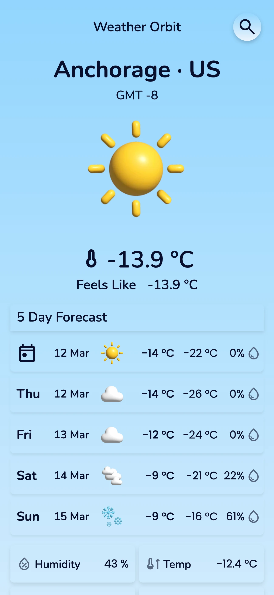
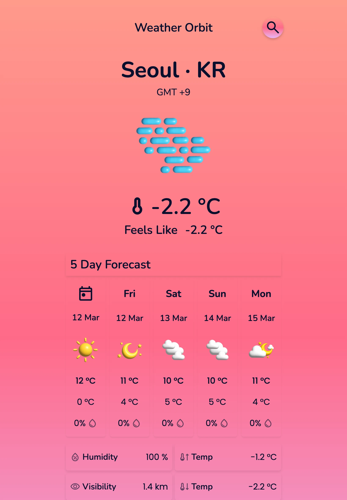
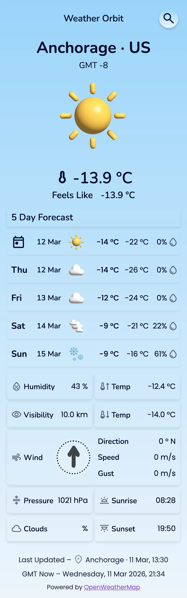
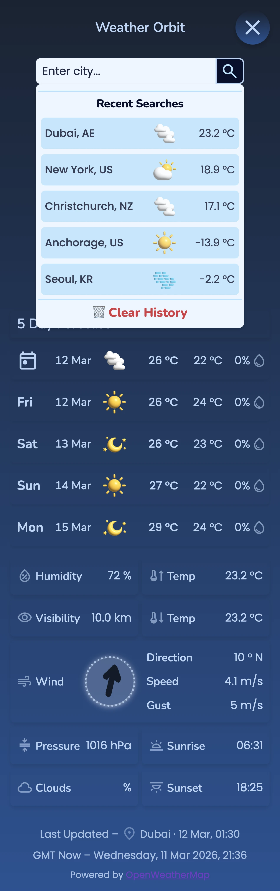

# 🌦️ Weather App

A responsive weather application that displays current conditions and a 5-day forecast using real-time API data. Built with a focus on clean architecture, modular utilities, and production-ready structure.

## 🚀 Live Demo

[Git](https://kberthel.github.io/Weather-App/)

## 📸 Preview

<!--

-->

## 🧠 Project Purpose

This project was built to demonstrate:
real API integration
clean component architecture
reusable utility logic
defensive data validation
scalable folder structure

The goal was not only to build a working weather app, but to structure it in a way that reflects real-world frontend architecture.

## 🏗️ Architecture Overview

src/
├── components/ UI components
├── utils/ data + logic helpers
├── config/ configuration files
├── assets/ images + icons
└── App.jsx root component

Design Philosophy
Separation of concerns

This structure allows scaling without refactoring.

## ⚙️ Features

City search
Current weather conditions
5-day forecast
Dynamic weather backgrounds
Time-of-day logic (day/night)
Wind direction indicator
Error handling for failed API calls
Loading states
Responsive layout

## 🦾 Challenges & Solutions

### Handling inconsistent API data

Some API responses returned missing or unexpected fields.To prevent UI crashes, a validation layer was added before data reached components.
Solution:Created utility validators and normalization functions to sanitize responses before rendering.

### Separating logic from UI

Early versions mixed data processing inside components, making debugging difficult.
Solution:Refactored logic into modular utilities grouped by responsibility (data, weather, time).

### Forecast grouping complexity

The forecast API returned time-slot entries instead of daily summaries.
Solution:Built a grouping utility that aggregates entries into clean daily forecast objects.

### User experience during loading

Instant loading made UI feel unresponsive.
Solution:Implemented skeleton loaders to indicate progress and improve perceived performance.

## 🧩 Key Engineering Decisions

### Normalization Layer

API responses are normalized before reaching UI components to keep the interface independent from raw API formats.
Reason:
UI should never depend on raw API format.

### Utility Modularity

Logic split into focused helpers such as:
weather validation
forecast grouping
time phase calculation
condition mapping
Benefit:
easier debugging, testing, and maintenance

### Robust Error Handling

The app safely handles:
invalid city input
missing API fields
network failures
empty responses

## 🛠️ Tech Stack

React
Vite
JavaScript (ES6+)
CSS
REST API

## 🔐 Environment Variables

API keys are stored securely using:

.env

Not committed to GitHub.

## 📦 Installation

Clone project:

git clone https://github.com/[username]/Weather-App.git
cd Weather-App
npm install
npm run dev

## 🧪 Future Improvements

Unit tests for utilities
Local storage for saved cities
Accessibility enhancements
Animated weather transitions
Offline support

## 🙏 Acknowledgements

Weather data provided by OpenWeather API.

Icons from Google Material Symbols.

Weather background images adapted from photos by  
Abid Shah and Farhat Altaf on Unsplash.
https://unsplash.com

## 👩‍💻 Author

K Berthel

Frontend development portfolio project built during my transition into tech.
